<p align="center">
  
</p>

# Awesome Online Proctoring 🛡️👀

<p align="center">
  <a href="https://github.com/ishandutta2007/Awesome-Awesome-Awesome"></a><a href="https://discord.gg/jc4xtF58Ve"></a>
  <a href="https://github.com/ishandutta2007/Awesome-Online-Proctoring/stargazers"></a>
  <a href="https://github.com/ishandutta2007/Awesome-Online-Proctoring/network/members"></a>
  <a href="https://github.com/ishandutta2007/Awesome-Online-Proctoring/pulls"></a>
  <a href="https://github.com/ishandutta2007/Awesome-Online-Proctoring/blob/main/LICENSE"></a>
  <a href="https://github.com/ishandutta2007"></a>
</p>

---

## 🌟 Curated Directory of Online Proctoring, Anti-Cheating & Exam Integrity Systems

> A curated list of top **SaaS platforms**, enterprise tools, and **open-source GitHub projects** for **Online Proctoring**, Remote Invigilation, AI Anti-Cheating, Browser Lockdown, Biometric Identity Verification, and Automated Session Recording.

Online proctoring technologies safeguard assessment integrity for higher education, standardized certification programs, licensing boards, and technical recruitment. Systems leverage multi-modal AI signals (webcam face liveness, gaze tracking, audio speech detection, screen capture, peripheral monitoring) and secure kiosk environments to prevent academic dishonesty and maintain test credibility.

---

## 📑 Table of Contents

- [🌐 Market Overview & Ecosystem Structure](#-market-overview--ecosystem-structure)
- [🏢 SaaS & Commercial Proctoring Platforms](#-saas--commercial-proctoring-platforms)
- [💻 Open-Source GitHub Projects](#-open-source-github-projects)
- [🏗️ Recommended Open-Source Architecture](#️-recommended-open-source-architecture)
- [🤝 How to Contribute](#-how-to-contribute)
- [⭐ Star History](#-star-history)
- [⚖️ Disclaimer & Ethics](#️-disclaimer--ethics)

---

## 🌐 Market Overview & Ecosystem Structure

> 📊 **Market Size & Valuation:** The global online proctoring market is estimated at **$1.8B – $2.4B in 2025/2026** and is projected to expand to **$4.5B – $8.2B by 2032–2035**, registering a **CAGR of ~13.5% – 16%**. 
>
> 🧩 **Market Structure:** The online proctoring sector is **moderately fragmented** rather than a winner-take-all monopoly. While major private-equity-backed giants and established enterprise suites (such as Meazure Learning, Mercer Mettl, and Honorlock) control large shares in institutional higher education and high-stakes certification, numerous specialized SaaS vendors and agile AI-first startups compete actively in niche areas like corporate developer hiring, asynchronous LMS assessments, and low-bandwidth remote invigilation.

---

## 🏢 SaaS & Commercial Proctoring Platforms

The table below details category-leading SaaS proctoring platforms sorted in **descending order by company scale** (estimated annual revenue, valuation, and capital raised):

| 🏢 Platform | 📝 Description & Highlights | 📈 Scale (Rev / Valuation / Funding) | 💵 Starting Pricing | 🎁 Free Tier / Free Trial Limits |
|:---|:---|:---|:---|:---|
| **[ProctorU (Meazure Learning)](https://www.meazurelearning.com/)** | Industry-leading live human and hybrid remote proctoring platform with real-time intervention for professional certifications, high-stakes university exams, and licensing. | **~$380M ARR** / ~$500M+ Est. Valuation (PE-backed by Gryphon Investors) | ~$12.60 – $15.00 / first hour per exam (+ $7.75 / additional hour) | No free plan; No self-serve trial (custom institutional pilot/demo available on request) |
| **[Examity](https://www.examity.com/)** | Multi-level automated, record-and-review, and live remote proctoring software with verified identity checks and institutional LMS integration. | **~$86.6M ARR** / $114M+ VC Funding (Acquired by Meazure Learning) | ~$3.75 – $5.00 / exam (Automated tier); ~$14.00 – $20.00 / exam (Live tier) | No free plan; No self-serve trial (institutional evaluation demo available on request) |
| **[Mercer Mettl](https://mettl.com/)** | Comprehensive enterprise assessment and AI invigilation suite featuring Mettl Secure Browser (MSB), 3-point biometric proctoring, and test authoring. | **~$25M – $50M Unit ARR** (Marsh McLennan parent $20B+; Acquired for ~$40M+) | ~$2.00 – $5.00 / candidate assessment (or ~$2,000 / year base platform tier) | Free trial available with up to 5–10 sample test candidate assessments upon demo sign-up |
| **[Honorlock](https://honorlock.com/)** | Browser-extension AI proctoring with on-demand human proctor pop-in, secondary device detection, and search-engine test-leak prevention. | **~$21.1M – $30M ARR** / $39.3M Total Funding (Series B led by Owl Ventures) | ~$8.24 – $10.00 / exam (or ~$15.00 – $25.00 / student / year institutional rate) | No free plan; No self-serve trial (scheduled interactive demo available on request) |
| **[Talview](https://www.talview.com/)** | AI-powered recruitment and assessment platform combining automated video proctoring, lockdown browsers, and candidate cognitive testing. | **~$10M – $25M ARR** / $22.5M Total Funding (Series B) | ~$25,000 / year (enterprise platform tier) or ~$10.00 – $15.00 / candidate | No free plan; No self-serve trial (personalized solution demo available on request) |
| **[Proctorio](https://proctorio.com/)** | Scalable automated proctoring Chrome extension with zero-biometric-storage encryption, instant anomaly flags, and LMS lockdown. | **~$10M – $20M ARR** / Bootstrapped ($0 outside venture capital) | ~$8.00 – $15.00 / student / year (or $10 / single exam; $20 / course student-pay) | No free plan; No public trial (custom guided institutional demo available on request) |
| **[Inspera Proctoring](https://www.inspera.com/)** | European digital assessment ecosystem offering recorded video supervision, live invigilation, and secure kiosk browser integrations. | **~$10M – $15M ARR** / Backed by CGE Partners Growth Equity | ~$10.00 – $30.00 / student / year (or volume-based tier by proctoring mode) | No free plan; 6-month institutional pilot programs offered for qualifying universities |
| **[Respondus Monitor](https://web.respondus.com/)** | Seamless LMS companion to LockDown Browser using student webcams and AI review to automate exam invigilation in higher education. | **~$3M – $10M ARR** / Self-sustained profitable licensing (Est. 2000) | $4,950 / year flat fee (base tier for 1,000 seats; ~$4.95/seat) or $15 / student / year | 200 free seats/year included with LockDown Browser license; 2-month unlimited institutional free pilot |
| **[Smowl (Smowltech)](https://smowl.net/)** | Continuous biometric identity verification and multi-device automated monitoring platform tailored for universities and e-learning academies. | **~$2M – $5M ARR** / $3.88M Total Funding (backed by Sparkmind VC & Wayra) | ~$2.00 – $3.00 / exam (activity license) or ~$10.00 – $20.00 / student / year | Free trial includes 25 complimentary test proctoring licenses |

---

## 💻 Open-Source GitHub Projects

Explore the top open-source exam proctoring software, AI cheating detection algorithms, and secure kiosk browsers on GitHub, sorted in **descending order by star count**:

| 📦 Repository & Project | ⭐ Stars | 🛠️ Tech Stack & Focus | 🔍 Key Features & Capabilities |
|:---|:---:|:---|:---|
| **[vardanagarwal/Proctoring-AI](https://github.com/vardanagarwal/Proctoring-AI)** | [](https://github.com/vardanagarwal/Proctoring-AI/stargazers) | `Python` `OpenCV` `Dlib` `YOLOv3` | Automated computer-vision monitoring tracking eye gaze direction, head pose orientation, mouth movement (talking detection), and unauthorized electronic device recognition. |
| **[SafeExamBrowser/seb-win-refactoring](https://github.com/SafeExamBrowser/seb-win-refactoring)** | [](https://github.com/SafeExamBrowser/seb-win-refactoring/stargazers) | `C#` `.NET` `WPF` `CEF` | The gold standard open-source secure kiosk exam browser for Windows. Locks down the OS environment, blocks unauthorized shortcut keys, prohibits secondary displays, and restricts web browsing. |
| **[narender-rk10/MyProctor.ai](https://github.com/narender-rk10/MyProctor.ai-AI-BASED-SMART-ONLINE-EXAMINATION-PROCTORING-SYSYTEM)** | [](https://github.com/narender-rk10/MyProctor.ai-AI-BASED-SMART-ONLINE-EXAMINATION-PROCTORING-SYSYTEM/stargazers) | `Python` `Flask` `MySQL` `YOLOv4` | Comprehensive AI-based smart online examination proctoring framework offering face recognition, identity validation, suspicious movement logging, and instructor audit reports. |
| **[SafeExamBrowser/seb-mac](https://github.com/SafeExamBrowser/seb-mac)** | [](https://github.com/SafeExamBrowser/seb-mac/stargazers) | `Objective-C` `Swift` `Cocoa` | Safe Exam Browser for macOS and iOS devices, establishing a secure testing environment natively integrated with Moodle, Canvas, Blackboard, and Open edX. |
| **[braviaprime/proctorai](https://github.com/braviaprime/proctorai)** | [](https://github.com/braviaprime/proctorai/stargazers) | `JavaScript` `Node.js` `Python` `OpenCV` | Full-stack web examination system with integrated webcam facial verification, audio anomaly detection, and client-side browser/tab event listeners. |
| **[krishnakumaragrawal/AI-Online-Exam-Proctoring-System](https://github.com/krishnakumaragrawal/Artificial-Intelligence-based-Online-Exam-Proctoring-System)** | [](https://github.com/krishnakumaragrawal/Artificial-Intelligence-based-Online-Exam-Proctoring-System/stargazers) | `Python` `OpenCV` `TensorFlow` `Keras` | AI-based proctoring prototype designed to ensure exam integrity via facial feature extraction, head angle tracking, and multiple person presence detection. |
| **[AarambhDevHub/exam-cheating-detection](https://github.com/AarambhDevHub/exam-cheating-detection)** | [](https://github.com/AarambhDevHub/exam-cheating-detection/stargazers) | `Python` `OpenCV` `Streamlit` | Real-time cheating detection dashboard tracking candidate eye movements, face position off-screen, background audio spikes, and automated infraction warning triggers. |
| **[aungkhantmyat/The-Online-Exam-Proctor](https://github.com/aungkhantmyat/The-Online-Exam-Proctor)** | [](https://github.com/aungkhantmyat/The-Online-Exam-Proctor/stargazers) | `Python` `YOLOv8` `MediaPipe` `PyQt` | Multi-modal proctoring utility combining facial liveness detection, head pose estimation, banned object classification, and operating system shortcut interception. |
| **[kamlendras/OpenProctor](https://github.com/kamlendras/OpenProctor)** | [](https://github.com/kamlendras/OpenProctor/stargazers) | `TypeScript` `Next.js` `WebRTC` `Tailwind` | Modern open-source online proctoring web application with live candidate video streaming, session event recording, and proctor review timelines. |
| **[lebmatter/exampro](https://github.com/lebmatter/exampro)** | [](https://github.com/lebmatter/exampro/stargazers) | `Python` `JavaScript` `Frappe` `MariaDB` | Proctored exam delivery application built on top of the Frappe Framework, featuring continuous webcam monitoring, screen capture, and violation-based exam termination. |
| **[Hiteshydv001/Guard-AI](https://github.com/Hiteshydv001/Guard-AI-Designing-Remote-Proctoring-System)** | [](https://github.com/Hiteshydv001/Guard-AI-Designing-Remote-Proctoring-System/stargazers) | `Python` `OpenCV` `MediaPipe` `Flask` | Lightweight remote proctoring engine with intelligent algorithms to flag rapid head rotations, extended off-screen gaze, and room background speech. |

---

## 🏗️ Recommended Open-Source Architecture

When designing a production-ready, privacy-first, and cost-effective remote proctoring pipeline using open-source building blocks, consider the following layered architecture:

```
┌─────────────────────────────────────────────────────────────────────────┐
│                     1. CLIENT RUNTIME & LOCKDOWN                        │
│   • Safe Exam Browser (SEB) / Electron Kiosk Wrapper                    │
│   • Clipboard Lockdown, App Switch Interception, Multi-Monitor Block    │
└────────────────────────────────────┬────────────────────────────────────┘
                                     │
┌────────────────────────────────────▼────────────────────────────────────┐
│                  2. EDGE AI SENSORS (BROWSER/CLIENT)                    │
│   • MediaPipe / TensorFlow.js / ONNX Runtime Web                        │
│   • Face Detection, Head Pose (Pitch/Yaw/Roll), Gaze Vector Estimation  │
│   • Edge Audio Level & Voice Activity Detection (VAD)                   │
└────────────────────────────────────┬────────────────────────────────────┘
                                     │ (JSON Telemetry & Keyframe Snapshots)
┌────────────────────────────────────▼────────────────────────────────────┐
│                    3. BACKEND & REVIEW AGGREGATOR                       │
│   • FastAPI / Node.js WebRTC Signaling & Ingestion                      │
│   • Anomaly Event Aggregation, Confidence Scoring & Flag Timeline       │
│   • Secure Encrypted S3 / MinIO Blob Storage for Incident Evidence      │
└────────────────────────────────────┬────────────────────────────────────┘
                                     │
┌────────────────────────────────────▼────────────────────────────────────┐
│                   4. LMS INTEGRATION & INSTRUCTOR UI                    │
│   • LTI 1.3 Advantage Integration (Moodle, Canvas, Open edX)            │
│   • Instructor Review Dashboard, Flagged Timestamp Jump & Grade Audit   │
└─────────────────────────────────────────────────────────────────────────┘
```

---

## 🤝 How to Contribute

Contributions, bug reports, and suggestions are warmly welcomed! 🚀

1. 🍴 **Fork the repository** on GitHub.
2. 🌿 **Create a new branch**: `git checkout -b feature/new-proctoring-tool`
3. ✍️ **Add or update entries**: Follow the existing tabular structure, ensuring factual descriptions, verified starting prices, exact free tier limits, and live GitHub star badges.
4. 📬 **Submit a Pull Request**: Include a clear summary of your additions.

---

## ⭐ Star History

[](https://star-history.dera.page/#ishandutta2007/Awesome-Online-Proctoring&type=date&legend=top-left)

---

## ⚖️ Disclaimer & Ethics

- **Curated Community Resource:** This repository is an educational compilation and does not constitute a formal commercial endorsement of any listed tool.
- **Privacy & Biometric Governance:** Remote online proctoring involves sensitive audio-visual telemetry and biometric processing. Educational institutions and enterprises must ensure full compliance with regulatory standards (e.g., **GDPR**, **FERPA**, **COPPA**, and state-specific biometric privacy legislation).
- **Algorithmic Fairness & Accessibility:** Automated anomaly flags are statistical heuristics prone to false positives (e.g., lighting variations, neurodivergent behaviors, room noise). Platforms should always maintain human-in-the-loop oversight and accessible review appeal workflows.

---

<p align="center">
  <b>Built with ❤️ for educators, university assessment teams, developers, and researchers advocating for fair, transparent, and accessible digital exams.</b>
</p>
